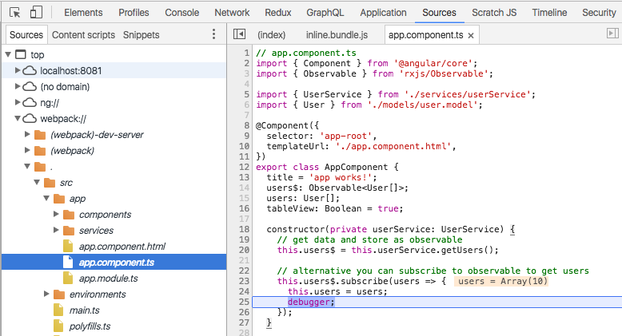

# Angular

<br>
<small>
by Peter Cosemans<br>
Copyright (c) 2017-2018 Euricom nv.
</small>

<!-- markdownlint-disable -->

<style type="text/css">
.reveal h1 {
    font-size: 3.0em;
}
.reveal h2 {
    font-size: 2.00em;
}
.reveal h3 {
    font-size: 1.00em;
}
.reveal p {
    font-size: 70%;
}
.reveal blockquote {
    font-size: 80%;
}
.reveal pre code {
    display: block;
    padding: 5px;
    overflow: auto;
    max-height: 800px;
    word-wrap: normal;
    font-size: 90%;
}
</style>

---

## TODO

@Injectable providers

```js
import { Injectable } from '@angular/core';

@Injectable({
  providedIn: 'root',
})
export class HeroService {
  constructor() { }
}
```

---

## Documentation

> Where to find information

Official website

[https://angular.io/](https://angular.io/)

NgDoc

[http://ngdoc.io](http://ngdoc.io/#)

Newsletter

[https://www.ng-newsletter.com/](https://www.ng-newsletter.com/)

---

# Angular CLI

> Quickly up and running

<!-- prettier-ignore -->
***

## Install and setup

https://github.com/angular/angular-cli

```bash
# install global
npm install @angular/cli -g

# verify version
$ ng --version

# getting help
$ ng help

# setup yarn as package manager
ng config -g cli.packageManager yarn
```

<!-- prettier-ignore -->
***

## Create App

Create

```bash
# create your app
ng new my-app
cd my-app
```

other options

```bash
ng new my-app --skip-git --style=less
ng new my-app --skip-git --skip-install --style=scss
```

<!-- prettier-ignore -->
***

## Startup

```bash
# Start with ng (angular cli)
ng serve

# or start with yarn
yarn start
```

Behind the scenes, the following happens:

- The CLI loads its configuration from angular.json
- The CLI runs Webpack to build and bundle all JavaScript and CSS code
- The CLI starts webpack dev server to preview the result on [localhost:4200](http://localhost:4200/)
- (Optional) the browser is opening the app

<!-- prettier-ignore -->
***

## File structure

Simplified file structure (no tests)

```
my-app
├── angular.json
├── package.json
├── src
│   ├── app
│   │   ├── app.component.css
│   │   ├── app.component.html
│   │   ├── app.component.ts
│   │   └── app.module.ts
│   ├── environments
│   │   ├── environment.prod.ts
│   │   └── environment.ts
│   ├── index.html
│   ├── main.ts
│   ├── polyfills.ts
│   ├── styles.css
│   └── tsconfig.app.json
├── .editorconfig
├── tsconfig.json
└── tslint.json
```

<!-- prettier-ignore -->
***

## Commands

Angular-cli provide lots of stuff

```bash
# version number
ng version

# Auto rebuild and reload on file change
ng serve
ng serve --port 8089 --open

# Build your app for production
ng build
ng build --prod
ng build --target=development --environment=prod

# Linting code
ng lint
ng lint --fix
ng lint --type-check --format=stylish
```

<!-- prettier-ignore -->
***

## Commands

```bash
# Runs your unit tests
ng test
ng tests --watch=false

# Other
ng e2e      # Runs your e2e tests
ng xi18n    # Extract i18n texts tags
ng eject    # Use webpack & webpack-dev-server directly
```

<small>
[https://github.com/angular/angular-cli/wiki](https://github.com/angular/angular-cli/wiki)
</small>
<br>

<!-- prettier-ignore -->
***

## Improved npm scripts

package.json

```json
{
  "scripts": {
    "serve": "ng serve --open",
    "build": "ng build",
    "build:prod": "ng build --prod",
    "lint": "ng lint --type-check --format=stylish --fix"
  }
}
```

- `serve`: Startup and serve web app with auto watch/compile
- `build`: Build for developement
- `build:prod`: Build for production (minimized, aot, etc...)
- `lint`: Run linting with type checking and fix

---

# The App

> What makes an Angular application

- Single index.html file
- Bootstrap
- Angular Modules
- Components
- Templates

<!-- prettier-ignore -->
***

There is only one (simple) html file.

```html
<html>
    <head>
      <title>MyApp</title>
      <base href="/">
    </head>
    <body>
        <app-root>Loading...</app-root>
    </body>
</html>
```

> The `script` and `link` tags are injected during serve/build time

<!-- prettier-ignore -->
***

## Angular bootstrap

main.ts (the entry point of the app)

```ts
// main.ts
import { platformBrowserDynamic } from '@angular/platform-browser-dynamic';
import { AppModule } from './app/app.module';

// browser bootstrap
platformBrowserDynamic().bootstrapModule(AppModule);
```

<!-- prettier-ignore -->
***

## Angular Module

An angular module (NgModule) combines multiple JS modules into an cohesive block of related functionality.

```js
// app/app.module.ts
import { BrowserModule } from '@angular/platform-browser';
import { NgModule } from '@angular/core';

@NgModule({
    import [
        // where this module depense on
        BrowserModule,
    ],
    declarations: [
        // all declared components, directives, pipes, ...
        AppComponent,
    ],
    providers: [
        // all services
    ],
    bootstrap: [AppComponent] // the root component
})

export class AppModule { }
```

<!-- prettier-ignore -->
***

## Angular Modules

- **_BrowserModule_**: Essential to launch and run a browser app. Imports the 'CommonModule'.
- **_CommonModule_**: All the basic Angular directives like NgIf, NgFor, ...
- **_FormsModule_**: Provide component for model driven forms.
- **_RouterModule_**: Adds router directives and providers.

> Import the modules you need

<!-- prettier-ignore -->
***

## Component

A component contains isolated logic that controls a region of the user interface. See it as extending html itself.

```js
// app.component.ts
import { Component } from '@angular/core';
@Component({
  selector: 'app-root',
  templateUrl: './app.component.html',
  styleUrls: ['./app.component.css'],
})
export class AppComponent {
  title = 'app works!';
}
```

index.html

```html
<h1>My App</h1>
<app-root></app-root>
```

> Always remember to declare component in your NgModule

<!-- prettier-ignore -->
***

## Templates

Templates are html snippets telling how Angular should render the component

```html
<h1>{{title}}</h1>
<div *ngIf="errMsg" class="error">{{errMsg}}</div>
<p>
    {{message}}
</p>
```

<!-- prettier-ignore -->
***

## Templates

Template can be written as a embedded template string <br>(use back tick)

```js
@component({
  selector: 'user-profile',
  template: `
        <h1>User</h1>
        {{ user.name }}
    `,
})
export class UserProfile {}
```

or as separated template file

```js
@component({
  selector: 'user-profile',
  templateUrl: './userProfile.component.html',
})
export class UserProfile {}
```

---

# Displaying data

> Power to the view

<!-- prettier-ignore -->
***

## Interpolation

Properties on the classs

```js
class AppComponent {
  constructor() {
    this.name = 'Peter';
    this.message = 'This is a description';
    this.pictureUrl = 'http://domain/myImage.png';
    this.wikiLink = 'https://en.wikipedia.org/wiki/Wiki';
  }
}
```

Can be bind to the template

```js
template: `
    <div>{{message}}</div>
    <div>Hello {{name}}</div>
`;
```

And to attributes

```html

<a href="{{wikiLink}}">Wiki</a>
```

<!-- prettier-ignore -->
***

### Interpolation

Use of objects

```js
class AppComponent {
  constructor() {
    this.employer = {
      // ...
      companyName: 'Euricom',
    };
  }
}
```

```html
<p>Employer: {{employer.companyName}}</p>
<p>Safe Employer: {{employer?.companyName}}</p>
```

<!-- prettier-ignore -->
***

## Template expressions

You can write expressions between the interpolation braces

```html
<h2>{{heading}}</h2>
<span>
    Error: {{'Error: ' + message}}</div>
</span>
Cnt: {{ 1 + cnt }}</div>
Name: {{person.sex === 'm' ? 'Mr' : 'Ms'}} {{person.name}}
```

> The expression is a subset of JavaScript

<!-- prettier-ignore -->
***

## Property binding

```
template: `
    ...
    <!-- Interpolation -->
    <div>Hello {{name}}</div>
    <div>{{message}}</div>

    <!-- Property Binding -->
    <div [textContent]="message"></div>
    <div [textContent]="'Some Title'"></div>
`
```

We have a binding to the textContent property of the dom element. See http://www.w3schools.com/jsref/prop_node_textcontent.asp

> Property binding is 'one way binding'

<!-- prettier-ignore -->
***

## Property binding

HTML is escaped when using interpollation

```js
class AppComponent {
    message = '<strong>Successfull saved</strong>`;
}
```

```
<div>{{message}}</div>
```

Is displayed as

```
&lt;strong&gt;Successfull saved&lt;/strong&gt;
```

Solution

```
<div [innerHTML]="message"></div>
```

<!-- prettier-ignore -->
***

### Property binding

```html
<!-- use as a string: 'Hello Jumpy' -->
<button title="Just click the button">
<button title="Hello {{ponyName}}">

<!-- use as expression -->
<button [title]="buttonTitle">Click me</button>
<input [value]="firstName">

<!-- class property binding: https://developer.mozilla.org/en-US/docs/Web/API/HTMLElement/style -->
<span [style.color]="red">Hello from span</span>
```

Some text magic

    <input type="range" min="10" max="300" value="32" #size (input)="x" />
    <h1 [style.font-size]="size.value + 'px'">
        My text style is magically set!
    </h1>

> With Angular, your API docs for binding to DOM elements is [MDN](https://developer.mozilla.org/en-US/docs/Web/API/Element).

<!-- prettier-ignore -->
***

## Angular Directives

`*ngIf`

```html
<section *ngIf="showSection">
```

`*ngFor`

```html
<ul>
    <li *ngFor="let contact of contacts">{{contact.name}}</li>
</ul>
```

```js
export class AppComponent {
  contacts = [{ id: 1, name: 'peter' }, { id: 2, name: 'wim' }];
}
```

`ngSwitch`

```html
<div [ngSwitch]="conditionExpression">
  <template *ngSwitchCase="case1Exp">...</template>
  <template *ngSwitchCase="case2Exp">...</template>
  <template *ngSwitchDefault>...</template>
</div>
```

<!-- prettier-ignore -->
***

### Angular Directives

`ngClass` & `ngStyle`

```html
<!-- Binding static class with interpollation -->
<button class="btn btn-{{buttonType}">Click Me</button>

<!-- Binding an array -->
<p [ngClass]="['warning', 'big']">

<!-- Binding an object -->
<div [ngClass]="{ active: isActive, disabled: isDisabled }">

<!-- set a style directly -->
<div [ngStyle]="{ 'color': 'red' }">
```

```js
export class MyComponent {
    isActive: boolean = true,
    isDisabled: boolean = false,
}
```

---

## Angular Pipes

A pipe takes in data as input and transforms it to a desired output.

    {{ 'Hello world' | uppercase }}
    {{ myDate | date }}

Parameterizing a Pipe

    <p>My birthday is {{ birthday | date:"MM/dd/yy" }}</p>

Chaining pipes

    <p>{{ data | date:"MM/dd/yy" | uppercase}}</p>

Available pipes:

`DatePipe`, `UpperCasePipe`, `LowerCasePipe`, `NumberPipe`, `CurrencyPipe`, `PercentPipe`, `JsonPipe`

See More: [Pipes docs](https://angular.io/api?status=stable&type=pipe)

> A pipe is the preferred way of formatting values & dates.

---

# Handling events

> User interaction

<!-- prettier-ignore -->
***

## Event Binding

A button click

    <!-- Event Bindig -->
    <button (click)="onClick()">Click me</button>

and the event handler

    class AppComponent {
        message: string;
        constructor() {
            this.name = 'Peter';
            this.message = 'This is a description'
        }
        onClick() {
            console.log('clicked');
        }
    }

<small>
We have a binding to the native click event of the button. <br>See http://www.w3schools.com/tags/ref_eventattributes.asp. <br>So we can use any existing (and future) event.
</small>

<!-- prettier-ignore -->
***

### Event Binding

An example with mouseOver

```html
<!-- template -->
<button (mouseover)="onMouseOver()">Click me</button>

// code
onMouseOver() {
    console.log('mouseOver');
}
```

You can get the native event

```html
<!-- template -->
<button (click)="onClick($event)">Click me</button>

// code
class AppComponent {
    ...
    onClick(event) {
        console.log('clicked', event);
    }
}
```

<!-- prettier-ignore -->
***

## Local Variable

```html
<!-- Local variable -->
Name: <input type="text" #nameInput/>
Output: {{nameInput.value}}

<!-- Event Binding -->
<button (click)="onClick($event, nameInput.value)">Click me</button>

// code
class AppComponent {
    ...
    onClick(event, value) {
        console.log('onClicked', event, value);
    }
}
```

---

# Exercise

> Toggle the visibility of a text on the screen by a click on a button

- Try to find multiple solutions

---

# Debugging

> If debugging is the process of removing software bugs, then programming must be the process of putting them in.

<!-- prettier-ignore -->
***

### Enabling and disabling debugging

Angular 2 applications have development mode enabled by default.

```
Angular 2 is running in the development mode. Call enableProdMode() to enable the production mode.
```

See main.ts

```
import { enableProdMode } from '@angular/core';
import { platformBrowserDynamic } from '@angular/platform-browser-dynamic';

import { AppModule } from './app/app.module';
import { environment } from './environments/environment';

if (environment.production) {
  enableProdMode();
}

platformBrowserDynamic().bootstrapModule(AppModule);
```

<!-- prettier-ignore -->
***

## JSON Pipe

The JSON pipe can help you debug by representing models as JSON objects.

```
<p> I can see the whole model here! :</p>
{{hero | json}}
```

<!-- prettier-ignore -->
***

## Debugger

Enabling source maps to see the TypeScript code of your application.

```json
{
  "compilerOptions": {
    "sourceMap": true
  }
}
```

In your source code put the debugger statement

```js
constructor(service: MyService) {
    service.getCustomers()
        .subscribe(data => this.data = data);
    debugger;
}
```

<!-- prettier-ignore -->
***

## Debugger

Or open the sources, navigate and set break point



<!-- prettier-ignore -->
***

## Augury

[Angular Augury](https://augury.angular.io/) is a great way to make the debugging process of your application more visual.


<!-- prettier-ignore -->
***

## Logging

console.log (and .warn, .error, .table) is your friend.

```js
onClick(event) {
    console.log('button clicled', event)
}
```

DON'T use it for production code!

```js
// ngx-logger
export class YourComponent {
    constructor(private logger: NGXLogger) {
        this.logger.info('Your log message goes here');
        this.logger.error('Error message', err);
    };
}
```

Consider to use pure JS solution

```js
import log from 'loglevel'
onClick(event) {
    log.info('button clicled', event)
}
```

---

# Components

> In and outs of a component

<!-- prettier-ignore -->
***

## Component

The minimal component

user.component.ts

```js
import { Component } from '@angular/core';
@Component({
  selector: 'user',
  template: `
    <h1>My User Component</h1>
  `,
})
export class UserComponent {
  constructor() {}
}
```

<!-- prettier-ignore -->
***

### Component

And you need to register it in the `app.module.ts`

```js
import { UserComponent } from './user/user.component';
@NgModule({
  declarations: [
    AppComponent,
    UserComponent       // <- add your component here
  ],
  ...
})
export class AppModule { }
```

And use it

```html
<h1>User</h1>
<user></user>
```

<!-- prettier-ignore -->
***

## Lifecycle hooks

```js
import { Component, OnInit, OnDestroy, OnChanges } from '@angular/core';

@Component({
    ...
})
export class MyComponent implement OnInit, OnDestroy, OnChanges {
    ngOnInit() {
    }

    ngOnChange() {
    }

    ngOnDestroy() {
    }
}
```

<small>
    More see: https://angular.io/docs/ts/latest/guide/lifecycle-hooks.html
</small>

<!-- prettier-ignore -->
***

## Input

Getting input data from the parent: `@Input()`

```js
import { Component, OnInit, Input } from '@angular/core'

@Component({
    selector: 'user-profile',
    ...
})
export class UserProfileComponent implements OnInit {
    @Input() type: String
    @Input() user: User

    constructor() {
    }

    ngOnInit() {
        // you can access the input properties in the ngOnInit function
        console.log('type', this.type)
    }
}
```

```html
<user-profile [type]="displayType" [user]="currentUser"></user-profile>
```

<!-- prettier-ignore -->
***

## Input changes

// Setter function

```
@Input()
  set end(endRange: number) {
    this.endRange = endRange;
    console.log('end range is changed: ', this.endRange)
  }
```

// Lifecycle hook

```js
export class MyComponent implement OnInit, OnChanges {
    @Input('end') endRange;

    ngOnChange() {
        console.log('initial end range: ', this.endRange)
    }

    ngOnChange() {
        console.log('end range is changed: ', this.endRange)
    }
}
```

<!-- prettier-ignore -->
***

## Output

Sending data to parent: `@Output()`

```js
import { Component, OnInit, Input, Output, EventEmitter } from '@angular/core'

@Component({
    selector: 'user-profile',
    ...
})
export class UserProfileComponent implements OnInit {
    @Output() changed: new EventEmitter<string>();

    constructor() {
    }

    onClick() {
        this.changed.emit('myEventValue')
    }
}
```

```html
<user-profile (changed)="onUserChanged($event)"></user-profile>
```

$event === 'myEventValue'

<!-- prettier-ignore -->
***

## Content Projection (transclusion)

Controlling the inner content of an component

```js
import { Component, Input, Output } from '@angular/core';
@Component({
  selector: 'card',
  template: `
    <div class="card">
        <span class="card-header">{{ title }}</span>
        <div class="card-content">
            <ng-content></ng-content>
        </div>
    </div>
  `,
})
export class CardComponent {
  @Input() title: string;
  constructor() {}
}
```

```html
<card title="My User Card">
    <!-- put your dynamic content here -->
    <p>For example this line of text</p>
    <!-- end dynamic content -->
</card>
```

<small>
You can have [multi-slot projection](https://scotch.io/tutorials/angular-2-transclusion-using-ng-content)
</small>

<!-- prettier-ignore -->
***

## Parent to Child

Get a reference to a child: `@ViewChild()` or `@ViewChildren()`

```js
// userListComponent.js
@component({
  template: `
        <filter></filter>
    `,
})
export class UserListComponent {
  @ViewChild(FilterComponent) filter: FilterComponent;

  getUsers() {
    this.apiService.getUsers().then(users => {
      this.users = users;
      this.filter.clear();
    });
  }
}
```

```js
// filterComponent.js
export class FilterComponent {
  clear() {
    this.filter = '';
  }
}
```

<small>
You also have @ContentChild/@ContentChildren which looks for elements in your components content (the nodes projected info the component).
</small>

---

## Styling

> All about the visual

<!-- prettier-ignore -->
***

## Global Styling

Add your styles to styles.css

```css
// style.css
body {
  background-color: powderblue;
}
```

Using less

```json
// angular.json
"styles": [
    "styles.less"
],
```

or sass

```json
// angular.json
"styles": [
    "styles.scss"
]
```

<!-- prettier-ignore -->
***

## Global Styling

add 3th party styling

```bash
$ npm install bootstrap --save
```

Add config in angular.json

```json
// angular.json
"styles": [
    "styles.css",
    "../node_modules/bootstrap/dist/css/bootstrap.css"
],
```

or use scss import

```scss
// style.scss
@import '~bootstrap/dist/css/bootstrap.css`
```

`'~'` is a webpack extension to resolve css modules

<!-- prettier-ignore -->
***

## Component Styling

Separated styling file (default)

```js
@Component({
  selector: 'my-zippy',
  templateUrl: './myZippy.component.html',
  styleUrls: ['./myZippy.compoment.css'],
})
export class ZippyComponent {}
```

Inline styling

<!-- prettier-ignore -->
```js
@Component({
  selector: 'my-zippy',
  templateUrl: './myZippy.component.html',
  styles: [`
    h1 {
        color: red;
    }
    .zippy {
      background: green;
    }
  `],
})
export class ZippyComponent {}
```

> By default all component styles are isolated and not global (you can change this)

<!-- prettier-ignore -->
***

### View Encapsulation

You can specify the view encapsulation

```js
@Component({
    ...
    encapsulation: ViewEncapsulation.Emulated  // default
})
export class MyComponent { }
```

Available ViewEncapsulation Types:

- ViewEncapsulation.None
- ViewEncapsulation.Emulated
- ViewEncapsulation.Native

[See more](https://blog.thoughtram.io/angular/2015/06/29/shadow-dom-strategies-in-angular2.html)

<!-- prettier-ignore -->
***

#### View Encapsulation

To target the component itself

```html
<!-- root of the component -->
<div class="my-component">
    <!-- other markup -->
</div>
```

```css
.my-component {
  display: block;
  border: 1px solid black;
}
```

Better to use: `:host`

```css
:host {
  display: block;
  border: 1px solid black;
}
```

---

## Exercise

- Create dismissible bootstrap alert
- Use [bootstrap styling](http://getbootstrap.com/components/#alerts-dismissible)
- Don't use jquery or the bootstrap js library
- Log a message to the console if the Alert is closed

```html
    <!-- default alert: warning -->
    <alert>
        Almost out of stock
    </alert>

    <!-- info alert -->
    <alert type="info">
        You can order online.
    </alert>

    <!-- danger alert with close button -->
    <alert type="error" (closed)="onClosed()">
        <strong>Alert!</strong> We have a problem.
    </alert>
```

---

# Services

> A place for common logic.

Keep so little logic in your components as possible, use services to handle the business logic.

<!-- prettier-ignore -->
***

## Services

A simple service

```js
import { Injectable } from '@angular/core'

@Injectable()   // mark service that it can have dependencies
export class UserService {
    getUsers() {
        return [
            { id: 1, name: 'john', role: 'admin'}
            { id: 1, name: 'peter', role: 'guest'}
        ]
    }
}
```

<!-- prettier-ignore -->
***

## Services

And use it (with Dependency Injection)

```js
import { UserService } from './services/userService'
...
export class UserListComponent implements OnInit {
    users = [];
    // userService is injected by
    // the Angular Dependency Injection
    constructor(private userService: UserService) {
    }

    ngOnInit() {
        this.users = this.userService.getUser();
    }
}
```

<!-- prettier-ignore -->
***

## Service registration

You need to register the service in your NgModule

```js
import { UserService } from './services/userService'
...

@NgModule({
    declarations: [
        ...
    ],
    providers: [
        UserService,
    ],
})
```

<!-- prettier-ignore -->
***

## Services Dependencies

You can use services in services, like the Angular http service

```js
import { Injectable } from '@angular/core'
import { HttpClient } from '@angular/common/http'

@Injectable()    // <-- Need to add this decorator
export class UserService {
    constructor(private http: HttpClient) {
    }
    getUsers(): Promise<IUser[]> {
        return this.http.get('/api/users');
    }
}
```

---

# Resources

- [NgDoc](http://ngdoc.io/#)
- [Cheat Sheet](https://angular.io/guide/cheatsheet)
