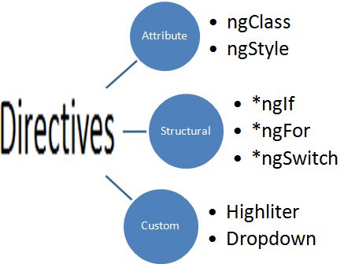

# Angular - Directives
<br>


---

# Directives
> Extend the DOM

----

## Overview

An Attribute directive changes the appearance or behavior of a DOM element.

There are three kinds of directives in Angular:

<br>

- ***Components*** — directives with a template.
- ***Attribute directives*** — change the appearance or behavior of an element, component, or another directive.
- ***Structural directives*** — change the DOM layout by adding and removing DOM elements (like *ngIf, *ngFor)


----

## Attribute directives

A simple sample

```ts
import { Directive, ElementRef, Input } from '@angular/core'

@Directive({
    selector: '[myHighlight]'
})
export class HighlightDirective {
    constructor(el: ElementRef) {
       el.nativeElement.style.backgroundColor = 'yellow'
    }
}
```

```html
<h1>My First Attribute Directive</h1>
<p myHighlight>Highlight me!</p>
```

----

## DOM Events

Don't use direct DOM eventhandlers.

```ts
import { Directive, ElementRef, HostListener, Renderer } from '@angular/core'

export class HighlightDirective {
    @HostListener('mouseenter', ['$event'])
    onMouseEnter(event: Event) {
        this.highlight('yellow')
    }

    @HostListener('mouseleave')
    onMouseLeave() {
        this.highlight(null)
    }

    constructor(private el: ElementRef, private renderer: Renderer) {
    }

    private highlight(color: string) {
        // Better to use renderer
        // this.el.nativeElement.style.backgroundColor = color
        this.renderer.setElementStyle(this.el.nativeElement, 'background-color', color)
    }
}
```

> The @HostListener decorator lets you subscribe to events of the DOM element

----

## Binding to an @Input property

```ts
export class HighlightDirective {
    // name of the varible must be the same as the selector name!
    @Input() myHighlight: string;

    ...
    @HostListener('mouseenter')
    onMouseEnter() {
        this.highlight(this.highlightColor || 'red');
    }
    ...
}
```

Use

```html
<p [myHighlight]="color">Highlight me!</p>
<p myHighlight="red">Highlight me!</p>
```

> `color` is an expression of the parent component

Alternative

```js
// rename the variable
@Input('myHighlight') highlightColor: string;
```

----

## Exercise
> Create an ngShow directive that uses 'display:none' to hide an element.

----

## Response on changes

```js
@Directive({
  selector: '[myShow]',
})
export class NgShowDirective implements OnChanges {
  @Input('myShow') ngshow;
  constructor(private el: ElementRef, private renderer: Renderer) {}

  // ngOnChanges is called when the input changes
  ngOnChanges(changes) {
    let display = !show ? : 'none' : 'block';
    this.renderer.setElementStyle(this.el.nativeElement, 'display', display);
  }
}
```

Alternative

```js
@Input()
set myShow(show: boolean) {
    let display = !show ? : 'none' : 'block';
    this.renderer.setElementStyle(this.el.nativeElement, 'display', display)
}
```


----

## Structural Directive

```ts
import { Directive, Input, TemplateRef, ViewContainerRef } from '@angular/core'

@Directive({ selector: '[myIf]' })
export class IfDirective {
    constructor(private templateRef: TemplateRef<any>,
                private viewContainer: ViewContainerRef) { }
    @Input()
    set myIf(shouldAdd: boolean) {
        if (show) {
            // If condition is true add template to DOM
            this.viewContainer.createEmbeddedView(this.templateRef);
        } else {
            // Else remove template from DOM
            this.viewContainer.clear()
        }
    }
}
```

Use

```
<p *myIf="toggle">
    ....
</p>
```

<small>
More: [Writing A Structural Directive in Angular 2](https://teropa.info/blog/2016/03/06/writing-an-angular-2-template-directive.html)
</small>


