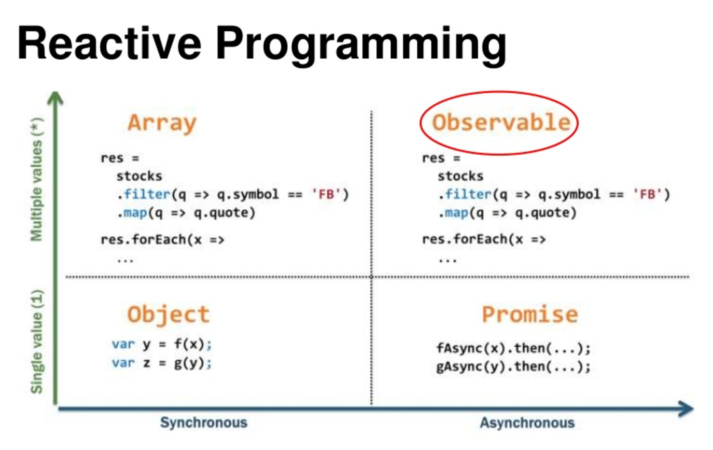
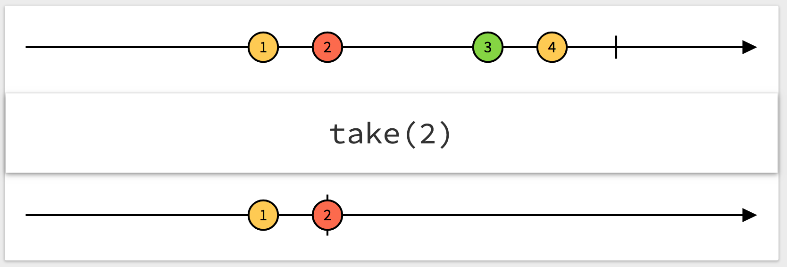

<!-- markdownlint-disable -->

<style type="text/css">
.reveal h1 {
    font-size: 3.0em;
}
.reveal h2 {
    font-size: 2.00em;
}
.reveal h3 {
    font-size: 1.00em;
}
.reveal p {
    font-size: 70%;
}
.reveal ul ul li {
    font-size: 70%;
}
.reveal blockquote {
    font-size: 80%;
}
.reveal pre code {
    display: block;
    padding: 5px;
    overflow: auto;
    max-height: 800px;
    word-wrap: normal;
    font-size: 90%;
}
</style>

# Javascript - RxJS
<br>
> Everything is an event

<small>by Peter Cosemans</small>

<small>
Copyright (c) 2017 Euricom nv.
</small>

---

# Intro
> What the hell is RxJS

----

## ReactiveX

ReactiveX is an API for asynchronous programming with observable streams.

<br>
http://reactivex.io/

<hr>

## RxJS

RxJS stands for Reactive Extensions for Javascript, and its an implementation of Observables for Javascript.

----

## Language Implementations

- ***JavaScript: RxJS***
- Java: RxJava
- C#: Rx.NET
- C#(Unity): UniRx
- Scala: RxScala
- Clojure: RxClojure
- C++: RxCpp
- Lua: RxLua
- Ruby: Rx.rb
- Python: RxPY
- Groovy: RxGroovy
- JRuby: RxJRuby
- Kotlin: RxKotlin
- Swift: RxSwift
- PHP: RxPHP
- Elixir: reaxive

----

## Reactive Programming

Is programming with asynchronous stream like:

    + mouse clicks
    + button events
    + keyboard
    + other events

    Events: [1,...,2,3,...,4,5,...,6]

But also

    + arrays
    + single value
    + error(s)
    + nothing (empty stream)

    Collection: [1, 2, 3, 4, 5, 6]

----

## Arrays and Events are collections/stream

</img>

Arrays are a collections of values.<br>
Events are fundamentally a collection of things, happens over time.

----

# Everything can be defined as a stream

And so be observed as a stream.

----

## RxJS4 - RxJS 5 - RxJS 6

- RxJS 4: Initial RxJS from Microsoft.
- RxJS 5: Full rewrite of RxJS for Angular
    - Better performance
    - Better debugging
    - Compliance with the ES7 Observable Spec
    - API is changed!
- RxJS 6: Optimized version.
    - Tree-shaking optimizable
    - API is changed, but compatibility layer is available.

[RxJS v5.x to v6 Update Guide](https://github.com/ReactiveX/rxjs/blob/master/docs_app/content/guide/v6/migration.md)

[RxJS 6: What's new and what has changed?](https://auth0.com/blog/whats-new-in-rxjs-6/)

---

## Quickstart

> Your first observables

----

## Observe event

Observable from event

```js
import { fromEvent } from 'rxjs';
const btn = document.querySelector('#btn')   // <button id="btn">Click</button>
const btnStream$ = fromEvent(btn, 'click')
```

And subscribe to it

```js
btnStream$.subscribe((event) => {
    console.log('Clicked', event)
})
```

----

## Subscribe

```js
// with success, error and completed
btnStream$.subscribe(
    // first function: success
    event => {
        console.log('Clicked', event)
    },
    // second function: error
    err => {
        console.log('Err', err)
    },
    // third function: completed
    () => {
        console.log('Completed')
    }
)
```

----

### Subscribe

Object syntax

```js
btnStream$.subscribe({
    next(event) {
        console.log('Clicked', e)
    },
    completed() {
        console.log('|')
    },
    error(err) {
        console.log('Error', err)
    }
})
```

----



----

## Promise vs Observable

Promise

```js
const promise = service.doAction()
const otherPromise = promise
    .then(result => {
        console.log(result)
    })

// a promise execution returns back a promise.
```

vs Observable

```js
const observable$ = service.doAction()
const subscription = observable$
    .subscribe(result => {
        console.log(result)
    })

subscription.unsubscribe()

// a observable subscription returns a subscription
```

----

## toPromise

Transform observable to promise.

```js
import { fromEvent } from 'rxjs';
const btn = document.querySelector('#btn')   // <button id="btn">Click</button>
const btnStream$ = fromEvent(btn, 'click')
btnStream$.toPromise()
    .then(event => {
        console.log(event)
    })
```

----

## RxJS 5.x - RxJS 6.x

```js
// RxJS 5.x
import { Observable } from 'rxjs';
const btnStream$ = Observable.fromEvent(btn, 'click')


// RxJS 6.x
import { fromEvent } from 'rxjs';
const btnStream$ = fromEvent(btn, 'click')
```

---

# Creating an observable
> You can create an observable from almost anything

----

## from Event

Button click

```js
import { fromEvent } from 'rxjs';
const btn = document.querySelector('#btn')
const btnStream$ = fromEvent(btn, 'click')
```

Input change

```html
<input type="text" id="input"></input>
```

```js
const input = document.querySelector('#input')
const inputStream$ = fromEvent(input, 'keyup')
inputStream$.subscribe((event) => {
    console.log(event.target.value)
})
```

----

## from Arrays

Create an observable from an iterator

```js
import { from } from 'rxjs';
const numbers = [1, 2, 3, 4, 5]
const numbers$ = from(numbers)
numbers$.subscribe({
    next(value) {
        console.log(value)
    },
    complete() {
        console.log('|')
    }
})
```

An finite Observable completes at the end of the stream

----

## Create an observable from...

```js
import { fromEvent, of, range, interval, timer } from 'rxjs';

// from event
const input = document.querySelector('#input')
const source = fromEvent(input, 'click')

// from array (iterable), primise or callback
const source = from([1,2,3,4,5])
const source = from('hello from RxJS')
const source = from(callback)
const source = from(promise)

// from single value
const source = of('I am an observable')

// from multiple values
const source = range(1, 20)
const source = interval(1000)
const source = timer(5000, 1000)
```

----

## Create an observable in error

```js
import { throwError } from 'rxjs';

// emits an error
const source$ = throwError(new Error('haha'))
source$.subscribe({
    error(error) {
        console.log(error)
    },
    complete() {
        console.log('|')
    }
})
```

A observable will finish with 'completed' or 'error', not both

----

## Observable Timers

Infinite Timers

```js
import { interval, timer } from 'rxjs';
```

```js
// event every second
const source$ = interval(1000)
source$.subscribe(x => {
    console.log(x)
})
```

```js
// wait 5 sec, then event every second
const source$ = timer(5000, 1000)
source$.subscribe(x => {
    console.log(x)
})
```

An infinite Observable never completes

----

## Create your own observable

```js
import { Observable } from 'rxjs';
const source$ = new Observable((observer) => {
    observer.next(1)
    observer.next(2)
    observer.next(3)
    observer.complete()
})

source$.subscribe(
    (val) => {
        console.log(val)
    },
    (err) = {}
    () => {
        console.log('|')
    }
)

// output 1, 2, 3, |
```

----

### Create your own observable

More practical

```js
import { Observable } from 'rxjs';
function createFrom(array) {
    return new Observable(observer => {
        for(const item of array) {
            observer.next(item)
        }
        observer.complete()
    })
}

const source$ = createFrom([1, 2, 3, 4, 5])

```

----

## Create your own - timer

```js
import { Observable } from 'rxjs';
const source$ = new Observable(observer => {
    let i = 0;
    const token = setInterval(() => {
        observer.next(i++)
    }, 1000)
    return () => {
        // Any cleanup logic might go here
        clearInterval(token)
    }
})

const subscription = source$.subscribe(x => {
    console.log(x)
})

setTimeout(() => {
    // stop timer
    subscription.unsubscribe();
}, 5000)
```

----

## Error in stream

```js
const source$ = new Observer(observer => {
    observer.next('a value')
    observer.error(new Error('bad bad bad'))
    observer.next('yet another')
    observer.complete()
})
```

```js
source$.subscribe(
    (x) => console.log(x),
    (err) => console.log(err),
    () => console.log('|')
)
```

> Mark we don't have a completed now.

An settled stream is completed of failed.

---

## Operators
> To transform the observables

----

## Take operator

Take number of events

```js
import { Observable, interval } from 'rxjs'
import { take } from 'rxjs/operators';


// RxJS 6.x (pipeable operators)
interval(1000).pipe(
    take(5)
)
.subscribe(x => {
    console.log(x)
})

// RxJS 5.x
Observable
    .interval(1000)
    .take(5)
    .subscribe(x => {
        console.log(x)
    })

```

----

## Skip operator

Skip a number of events

```js
import { interval } from 'rxjs'
import { skip, take } from 'rxjs/operators';

interval(1000)
    .pipe(
        skip(1),
        take(5)
    )
)
.subscribe(x => {
    console.log(x)  // output 1, 2, 3, 4, 5
})


```

----

## Marble diagrams



```
const source$ = interval(1000);
.pipe(
    skip(1),
    take(5)
)
.subscribe(x => {
    console.log(x)
})
```

ASCII Marble Diagrams

```
// 0--1--2--3--4--5--6...
// ---1--2--3--4--5--6...
// ---1--2--3--4--5|
```

See also [take](http://rxmarbles.com/#take) and [skip](http://rxmarbles.com/#skip)

----

## Map operator

Map value to something else (based on the current value)

```js
import { interval } from 'rxjs'
import { take, map } from 'rxjs/operators';
const source$ = interval(1000).pipe(
    map(x => x * 2),
    take(5)
)
source$.subscribe(x => {
    console.log(x)
})
```

Marble Diagram
- [map](http://rxmarbles.com/#map)
- [take](http://rxmarbles.com/#take)


----

## Error handling

catchError ([Learn](https://www.learnrxjs.io/operators/error_handling/catch.html))

```js
import { of } from 'rxjs'
import { map, catchError } from 'rxjs/operators';
source$.pipe(
    map(val => val.name),
    catchError(err => {
        console.log(err)
        return of(err);  // Change err to success
    })
)
.subscribe(
    ...
)
```

----

## Error handling

retry ([Learn](https://www.learnrxjs.io/operators/error_handling/retry.html))

```js
import { ajax } from 'rxjs/ajax';
ajax('api/users').pipe(
    retry(2)  // retry on error
)
.subscribe(
    ...
)
```

Observables are lazy by default.

----

## Filter operators

filter ([Learn](https://www.learnrxjs.io/operators/filtering/filter.html) -
[Marbles](http://rxmarbles.com/#filter))

```js
const source$ = from([1,2,3,4,5]);
source$.pipe(filter(num => num % 2 === 0))
    .subscribe((val) => {
        console.log(`Even number: ${val}`)
    });
```

skip ([Learn](https://www.learnrxjs.io/operators/filtering/skip.html) -
[Marbles](http://rxmarbles.com/#skip))

```js
const source$ = from([1,2,3,4,5]);
source$.pipe(skip(2))
    .subscribe((val) => {
        console.log(val)
        // output
        // 3
        // 4
        // 5
    });
```

----

## Transformation operators

----

## Map operator

Map value to something else

```js
const source$ = interval(1000).pipe(
    map(x => x * 2)
)
```

## MapTo operator

Map to constant value

```js
const source$ = interval(2000).pipe(
    mapTo('HELLO WORLD!')
)
```

----

## Scan & Reduce operator

reduce ([Learn](https://www.learnrxjs.io/operators/transformation/scan.html)
[Marbles](http://rxmarbles.com/#scan))

```js
// reduce operator
const source$ = from([1, 2, 3, 4, 5]).pipe(
    reduce((acc, val) => {
        return acc + val;
    }, 0)
)
```

The reduces waits until the stream is completed! <br>
Use ```scan``` if you have an infinite stream or want the result on each event

```js
// scan operator
const source$ = interval(1000).pipe(
    scan((acc, val) => {
        return acc + val;
    }, 0)
)
```


----

## Do/Tap Operator

Logging ([Learn](https://www.learnrxjs.io/operators/utility/do.html))

```js
const source$ = interval(1000).pipe(
    tap(x = > console.log('before map', x))
    map(x => x.name)
    tap(x = > console.log('after map', x))
)

// RxJs 5.x (do operator)
const source$ = Observable.interval(1000)
    .do(x = > console.log('before map', x))
    .map(x => x + 1)
    .do(x = > console.log('after map', x))
)

```

----

## More Operators

```js
const stream$ = from(source).pipe(
    // retry: retry on error
    retry(3),
    // error, wait for 5 sec and retry
    retryWhen(errors =>
        errors.pipe(
            //log error message
            tap(val => console.log(`Value ${val} was too high!`)),
            //restart in 5 seconds
            delayWhen(val => timer(val * 1000))
        )
    ),
    timeout(2000),
    timeout(2000, new Error('timeout exceeded')),
    // No duplicated values
    distinctUntilChanges(),
    // Discard emitted values for x msec
    debounceTime(1000)
)
```

----

## Operators

#### Filter operators:
skip, take, filter, find, first, distinctUntilChanges, debounceTime, ...

#### Transform operators:
pluck, map, mapTo, ...

#### Mathematical operators:
count, sum, min, max, reduce, scan, ...

----

## Pure functions

All functions in our reactive flow must be pure:

- Given the same input, <br>will always return the same output
- Produces no side effects. <br>It may not mutate state outside of the function

```js
// bad
let cnt = 0;
$source = from([7,2,1,3,5]).pipe(
    map(val => {
        cnt = cnt + 1;      // outside state changed !!!!!!
        return cnt
    })
).subscribe(() => console.log(cnt))

// good
$source = from([7,2,1,3,5]).pipe(
    scan((val, total) => total + 1, 0)
).subscribe(() => console.log(cnt))
```

----

## Docs

- [Official Docs](https://rxjs-dev.firebaseapp.com/api)
- [Operators By Example](https://github.com/btroncone/learn-rxjs/blob/master/operators/README.md)
- [Learn RxJS](https://www.learnrxjs.io/)

---

# Exercises

Basic RXJS handling

---

# Combine observables
> Wait for all, in parallel or transform

----

### takeUntil

```js
const timer$ = timer(3000);
fromEvent(document, 'click').pipe(
  takeUntil(timer$)
)
.subscribe((event) => {
    console.log('i', event)
})
```

The stream completes when the document is clicked.

[Learn](https://www.learnrxjs.io/operators/filtering/takeuntil.html) -
[Marbles](http://rxmarbles.com/#takeUntil)

----

## merge

Combine to one stream

```js
of('Hello').pipe(
    merge(of(' Everyone'))
)
.subscribe(x => console.log(x))   // ouput: hello Everyone
```

```js
import { interval, merge } from 'rxjs'
import { map, take } from 'rxjs/operators';
const source1$ = interval(2000).pipe(map(x => x + 1000))
const source2$ = interval(500).pipe(map(x => x))

merge(source1$, source2$).pipe(take(25))
    .subscribe(x => console.log(x))
```


[Marbles](http://rxmarbles.com/#merge) -
[Learn](https://www.learnrxjs.io/operators/combination/merge.html)

----

## concat

One after the other

```js
import { range, concat } from 'rxjs'
const source1$ = range(0 /* start */, 5 /* count */)
const source2$ = range(7, 10)
concat(source1$, source2$)
    .subscribe(x => console.log(x))
```

[Marbles](http://rxmarbles.com/#concat) -
[Learn](https://www.learnrxjs.io/operators/combination/concat.html)

----

## forkJoin

Like Promise.all (wait until all is finished) - [Learn](https://www.learnrxjs.io/operators/combination/forkjoin.html)

```js
import { forkJoin } from 'rxjs'
import { ajax } from 'rxjs/ajax'
```

```js
const character$ = ajax('https://swapi.co/api/people/1/');
const characterHomeworld$ = ajax('https://swapi.co/api/planets/1/')

forkJoin(character$, characterHomeworld$)
    .subscribe(results => {
        console.log('homeworld' ,results[1])
        console.log('character', results[0])
    })
```
```js
forkJoin(
    ajax('https://swapi.co/api/people/1/').pipe(map(res => res.response)),
    ajax('https://swapi.co/api/planets/1/').pipe(map(res => res.response)),
)
.subscribe(results => {
    console.log('homeworld' ,results[1])
    console.log('character', results[0])
})
```

----

## CombineLatest & Zip

CombineLatest / Zip - [Marbles](http://rxmarbles.com/#combineLatest) -
[Learn](https://www.learnrxjs.io/operators/combination/combinelatest.html)

```html
<select id="type">
  <option value="users">Users</option>
  <option value="posts">Posts</option>
</select>
<select id="id">
  <option value="1">1</option>
  <option value="2">2</option>
</select>
```

```js
const typeSelect = document.getElementById('type');
const typeStream$ = fromEvent(typeSelect, 'change').pipe(
    map(event => event.target),
    map(target => (target.options[target.selectedIndex].text.toLowerCase())))

const idSelect = document.getElementById('id');
const idStream$ = fromEvent(idSelect, 'change').pipe(
    map(event => event.target),
    map(target => (target.options[target.selectedIndex].text)))

combineLatest(typeStream$, idStream$)
  .subscribe((event) => console.log('combined', event))
```

----

## switchMap

Switch over to a new observable stream. The second stream is stopped (unsubscribed) when there is a new event on the first stream.

```js
import { ajax } from 'rxjs/ajax'
fromEvent(document, 'click').pipe(
    switchMap(val => ajax('https://swapi.co/api/starships'))
)
.subscribe(val => {
    console.log(val)
})
```

[Learn](https://www.learnrxjs.io/operators/transformation/switchmap.html)

> Typical used with http.

---

# More to know
> What else do we have

----

## Subject

A Subject is both an Observable (so we can subscribe() to it) and an Observer (so we can call next() on it to emit a new value).

```js
import { Subject } from 'rxjs';
```

```js
var subject = new Subject()
subject.subscribe((v) => console.log('observerA: ' + v))
subject.subscribe((v) => console.log('observerB: ' + v))

subject.next(1)
subject.next(2)
subject.error(new Error('bad bad bad'))
```

So we can:

```js
const subject = new Subject()
button.addEventListener(‘click’, () => subject.next('click'))
subject.subscribe(x => console.log(x))
```

----

## Subject

You also have:

- [ReplaySubject](https://github.com/Reactive-Extensions/RxJS/blob/master/doc/api/subjects/replaysubject.md): stores all the values that it has published
- [BehaviorSubject](https://github.com/Reactive-Extensions/RxJS/blob/master/doc/api/subjects/behaviorsubject.md): it only stored the last value it published
- [AsyncSubject](): like BehaviorSubject but only when execution completes.

----

## EventBus

A subject use case.

```ts
import { Subject, Observable } from 'rxjs';
import { filter, map, share } from 'rxjs/operators';

export class EventBus {
  subject: Subject<any>;

  constructor() {
    this.subject = new Subject<any>();
  }

  publish(type: String, data: any): void {
    this.subject.next({ type, data });
  }

  listen(type: String): Observable<any> {
    return this.subject.pipe(
      filter((event: any) => event.type === type),
      map(event => event.data),
      share()
    )
  }

  unsubscribe() {
    this.subject.unsubscribe();
  }
}

export default new EventBus();
```

----

## EventBus

Cross module communication

```js
// myModule.ts
import eventBus from 'eventBus'

// public event on the bus
eventBus.publish('error', { type: 'xxx', message: 'test'})
```

```js
// myOtherModule.ts
import eventBus from 'eventBus'

// listen for event
eventBus.listen('error')
        .subscribe(error => {
            console.error(error.message);
        })
```


---

## Resources

Try to understand

- [http://reactivex.io/rxjs/](http://reactivex.io/rxjs/)
- [Learn rxjs](https://github.com/btroncone/learn-rxjs)
- [List of tutorials and videos](http://reactivex.io/tutorials.html)
- [RxJs The Smartest Dumbest Tool Ever](http://www.christianalfoni.com/articles/2016_03_31_RxJs-the-smartest-dumbest-tool-ever)
- [Testing reactive code](https://glebbahmutov.com/blog/testing-reactive-code/)
- [RxJS Observables Crash Course](https://www.youtube.com/watch?v=ei7FsoXKPl0)
- [Avoiding Common Mistakes Using Rxjs](https://egghead.io/lessons/rxjs-convert-an-underlying-source-of-data-into-an-observable?series=save-time-avoiding-common-mistakes-using-rxjs)
- [RxJS Subjects for human beings](https://netbasal.com/rxjs-subjects-for-human-beings-7807818d4e4d)
- [RxJS best practices in Angular](https://blog.strongbrew.io/rxjs-best-practices-in-angular)
